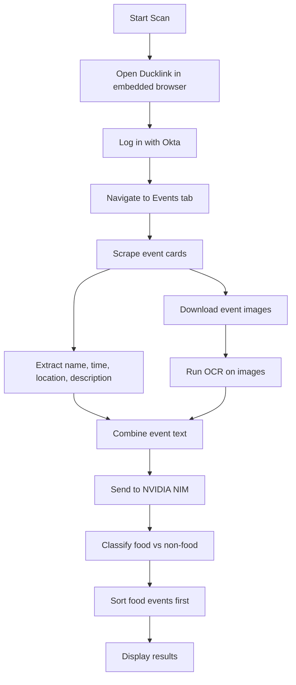

# Ducklink Food Finder

Mac desktop app that scans Stevens Ducklink for events, uses OCR plus an LLM to identify free food, and surfaces the best results first.

## What It Does

- Signs into Ducklink through the embedded browser flow
- Scrapes the current day's events from the Events tab
- Runs OCR on flyers and posters attached to events
- Uses NVIDIA NIM to classify whether an event likely has free food
- Shows food events first, followed by the rest
- Caches results and stores the API key securely on the machine

## Tech Stack

- Electron
- React
- Playwright
- Tesseract.js
- NVIDIA NIM
- electron-store

## Requirements

- macOS
- Node.js and npm
- A valid NVIDIA API key for food detection

## Getting Started

```bash
npm install
npm run dev
```

On first launch, enter your NVIDIA API key in the app settings.

## Available Scripts

- `npm run dev` - Start the app in development mode
- `npm run build` - Build the main and renderer bundles
- `npm run preview` - Preview the production build
- `npm run lint` - Run ESLint
- `npm run typecheck` - Run TypeScript checks for main and renderer
- `npm run pack` - Build and create an unpacked desktop app
- `npm run dist` - Build and create distributable packages
- `npm run dist:mac` - Build a macOS DMG
- `npm run cli` - Run the CLI entry point
- `npm run bench` - Run model benchmarking utilities

## App Flow

1. Open the app and start a scan.
2. Log in to Ducklink in the embedded browser.
3. Let the app navigate to the Events tab and scrape listings.
4. Wait while OCR and food detection run.
5. Review food events at the top of the results list.



## Project Structure

- `src/main` - Electron main process, services, and IPC handlers
- `src/preload` - Safe bridge between Electron and the renderer
- `src/renderer` - React UI, screens, components, and hooks
- `docs` - Architecture and implementation notes

## Packaging

The macOS build outputs a DMG via Electron Builder.

## License

MIT
